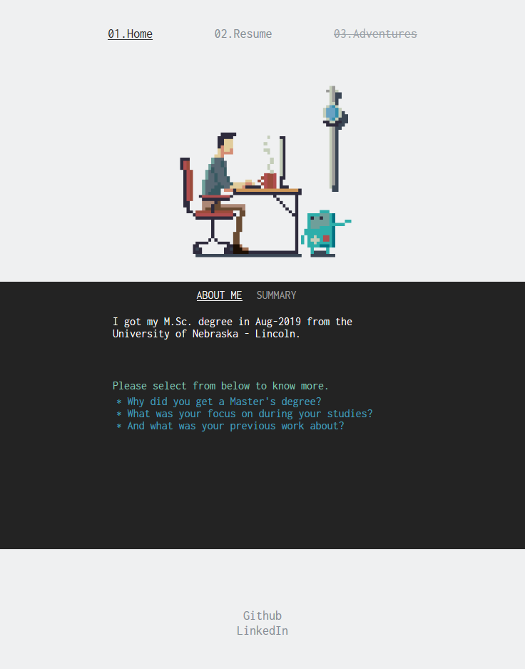

# Simple Personal Website on GitHub
On the home page it will have a terminal-like section where user/visitor can click on one of the displayed questions, and an answer will appear with a typing animation. There will be a SUMMARY section which will show most relavent things about be as a developer.

## Deploying your own react-based github page

There is a simple guide on how to deploy your react apps to github-pages here: https://create-react-app.dev/docs/deployment/.
Pay attention to the guide on how to get your ROUTES working on github pages, details available here: https://github.com/rafgraph/spa-github-pages 

## Available Scripts

In the project directory, you can run:

### `npm start`

Runs the app in the development mode.\
Open [http://localhost:3000](http://localhost:3000) to view it in the browser.

The page will reload if you make edits.\
You will also see any lint errors in the console.

## Learn More

You can learn more in the [Create React App documentation](https://facebook.github.io/create-react-app/docs/getting-started).

To learn React, check out the [React documentation](https://reactjs.org/).
